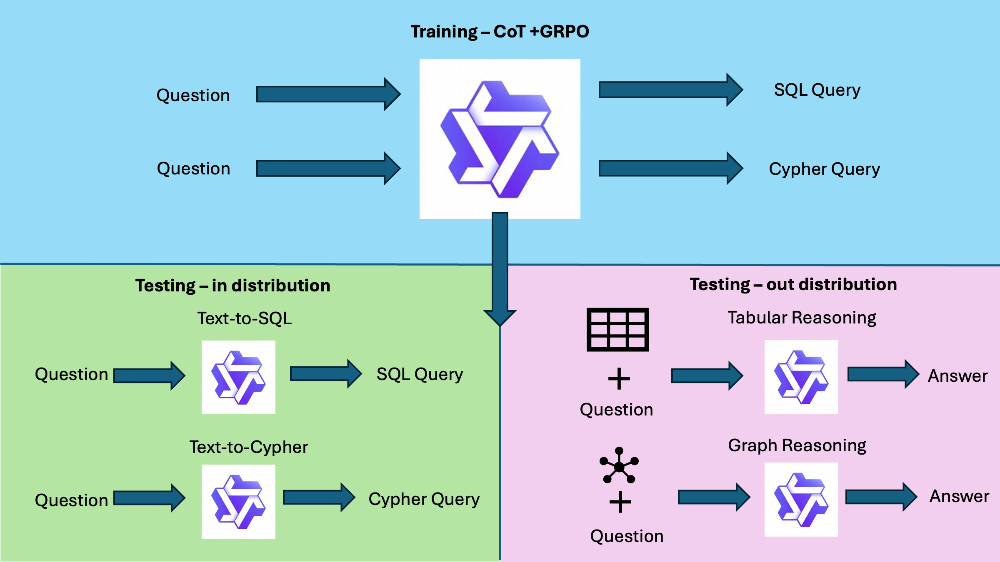

# STRuCT-LLM: Unifying Tabular and Graph Reasoning with Reinforcement Learning for Semantic Parsing

### Links

📖[Arxiv Paper]() |
🤗[Synthetic Cypher Data](https://huggingface.co/datasets/jls205/synthetic_cot_traces_cypher) |
🤗[Synthetic SQL Data](https://huggingface.co/datasets/jls205/synthetic_cot_traces_clinton)

---

## Introduction

This project investigates structured reasoning over relational and graph-structured data by employing reinforcement learning (RL) to train language models on Text-to-SQL and Text-to-Cypher tasks. While large language models (LLMs) excel in open-domain generation, they often struggle with structured reasoning essential for interaction with relational databases and knowledge graphs. By interleaving SQL and Cypher training, we foster shared structural representations that reduce task-specific overfitting and enhance cross-formalism transfer.

We introduce a novel topology-aware reward function for Cypher that improves parsing accuracy by capturing the correctness of the queried subgraph. Our unified training framework incorporates chain-of-thought (CoT) supervision, aiming to enhance reasoning capabilities for both query formats.



## Empirical Results

Our evaluations reveal significant performance improvements through joint training:

- Performance Gains: Models trained jointly on SQL and Cypher outperform those trained in isolation.
- Effective Reward Function: The topology-aware reward enhances the model's reasoning about node and edge connectivity in Cypher tasks.
- CoT and RL Integration: The combination of CoT supervision and RL fosters deeper understanding of relational and graph structures.
- Zero-Shot Generalization: The models demonstrate promising zero-shot performance on knowledge graph and tabular QA tasks.
- Transferable Skills: Our results indicate that the trained models develop structure-aware reasoning that transfers effectively across SQL and Cypher domains.
These findings highlight the potential of RL and unified training approaches to enhance structured reasoning in language models.


---


## Getting Started
We rely on unsloth for training and vllm for evaluation.

```
pip install -r requirements.txt
```

## Training

Refer to [training documentation](training/README.md) for explanations on:  

- Fine-tuning with Synthetic CoT Data.  
- GRPO implementation for reinforcement learning.  

## Evaluation

The evaluation pipeline supports the following tasks:  

1. **Text-to-SQL Benchmarks**: BIRD minidev, EHRSQL and Spider datasets.
2. **Text-to-SQL Benchmarks**: Text-to-Cypher dataset.  
3. **Table-based QA**: CRT-QA and Tablebench datasets.
4. **Graph-based QA**: LT-CRKGQA dataset.  

Refer to [evaluation documentation](evaluation/README.md).  

## Citation 

```bibtex
@article{...,
  title={...},
  author={Stoisser, Josefa Lia and Martell, Marc Boubnovski and Fauqueur, Julien},
  journal={arXiv preprint arXiv:...,
  year={2025}
}
```
